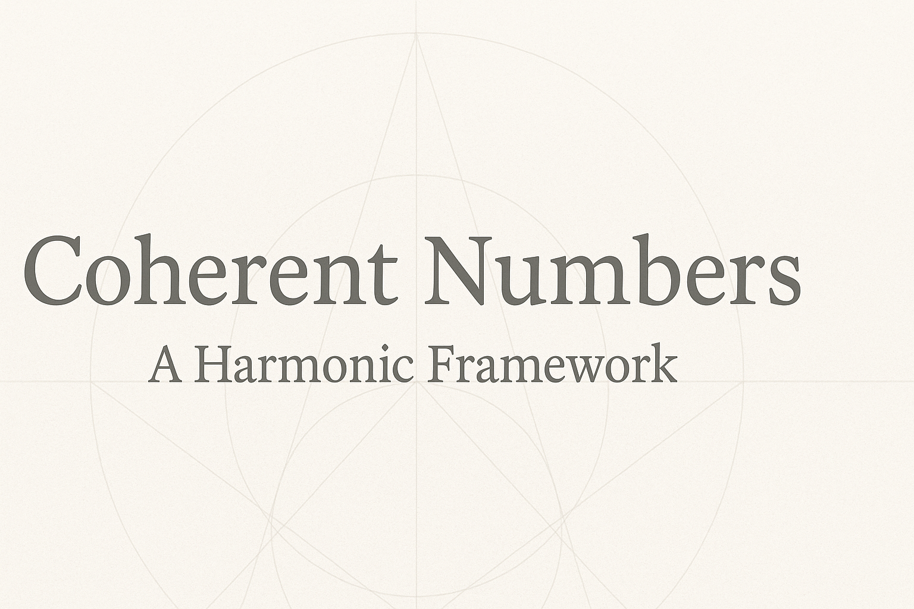

# Coherent Numbers  

  

**Author:** Djai Steven Charan  
**Project:** Walking With Soul – Sacred Physics  

Coherent Numbers present a harmonic mathematical framework where irrational or infinite quantities (like π) resolve into finite, coherent ratios across a twelve-phase base. The aim is to bridge mathematics, physics, and energy design by reintroducing geometric coherence as the invariant structure of reality.

## Repository Layout
- `paper/` – LaTeX source of the formal paper  
- `src/` – reference implementation (Python)  
- `notebooks/` – demonstrations  
- `docs/` – explainer assets  

## Quick Start
1. Install Python 3.10+.  
2. Open `src/coherent.py` and run with Python to explore simple examples.  
3. Compile the paper with LaTeX (see `paper/main.tex`).  

## License
MIT License © Djai Steven Charan
